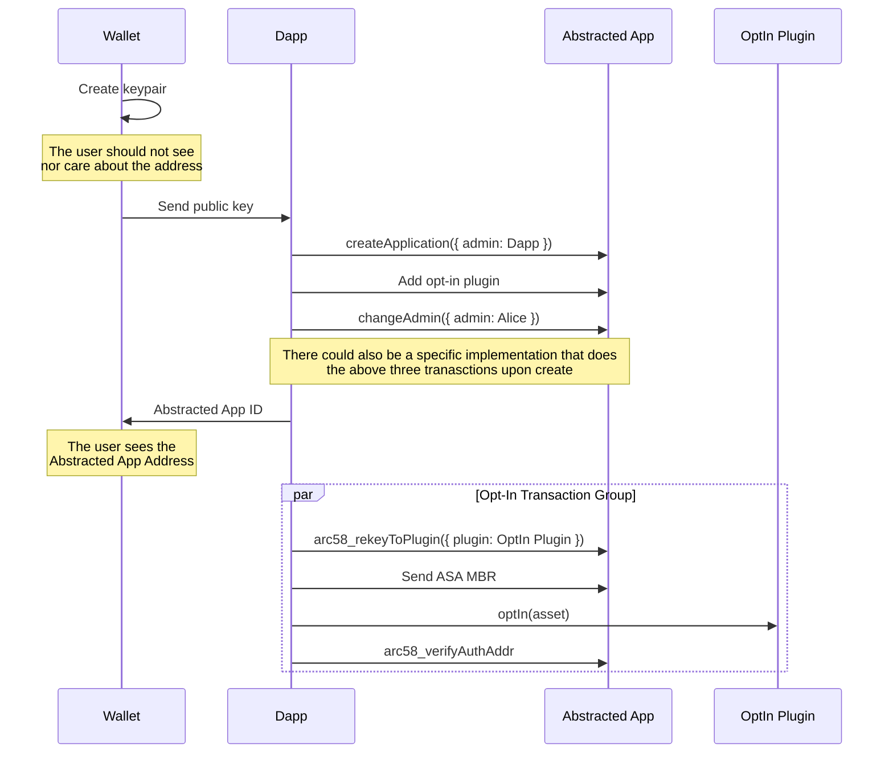
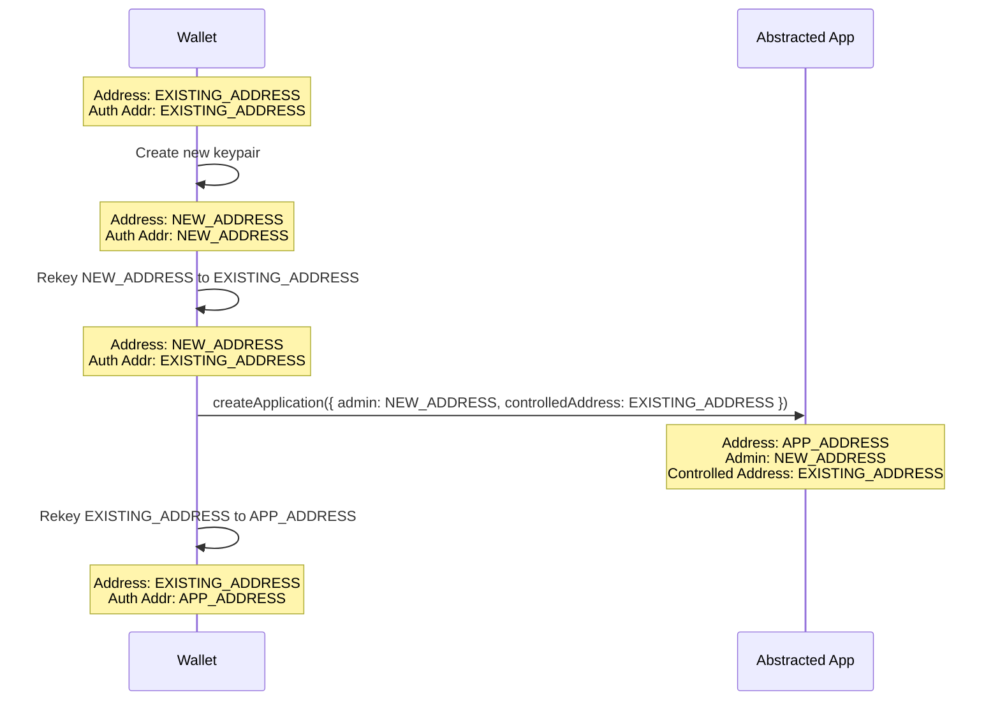

# Plugin-Based Account Abstaction

This repo contains proof-of-concept contracts for plugin-based account abstraction.

ARC58 PR: https://github.com/algorandfoundation/ARCs/pull/269

## Abstracted Account
[The abstracted account app](./contracts/abstracted_account.algo.ts) acts as the primary logic for the abstracted account. The app address of this app is effectively the end-user's address. The user can always rekey the contract address to their externally owned account (EOA) to gain more flexible control over the account. If the user wants to add more functionality to their abstracted account, they can add a plugin. A plugin is an app deployment that contains some functionality that sends inner transactions from the abstracted account (and eventually rekeys back).

## Plugins
[The subscription plugin](./contracts/plugins/subscription_plugin.algo.ts) is a plugin that allows someone to set up a recurring payment from the abstracted account.

[The OptIn plugin](./contracts/plugins/optin_plugin.algo.ts) is a plugin that allows anyone to opt the abstracted account into an asset, provided they pay for the MBR.

## Tests

Testing of both plugins can be found at [./\_\_test\_\_/abstract_account_plugins.test.ts](./__test__/abstract_account_plugins.test.ts)

Not all functionality of the abstracted account has been tested yet.

## Sequences

### Onboard New 0-ALGO Account

### Transition Existing Address

If a user wants to transition an existing keypair-based account to an abstracted account and use the existing secret key for admin actions, they need to perform the following steps

